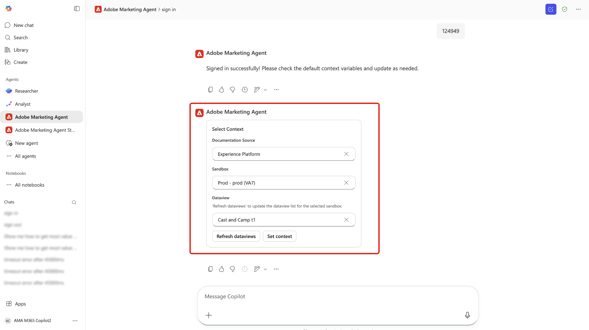

# Adobe Marketing Agent para [!DNL Microsoft 365 Copilot]

Adobe Marketing Agent para [!DNL Microsoft 365 Copilot] es una herramienta con tecnología de IA que conecta Adobe Experience Platform directamente con [!DNL Microsoft 365 Copilot]. Con este agente, puede hacer preguntas en lenguaje natural en aplicaciones de [!DNL Microsoft 365] como [!DNL Teams], [!DNL Word], [!DNL Powerpoint] y [!DNL Excel] para recuperar instantáneamente información de marketing de Experience Platform sin interrumpir el flujo de trabajo. El mismo agente está disponible en todas estas aplicaciones y el historial de chat de Adobe Marketing Agent se transfiere. De este modo, puede empezar a investigar en [!DNL Copilot] en [!DNL Teams], por ejemplo, y continuar la conversación en [!DNL Word] o [!DNL Powerpoint] mientras redacta un informe de campaña o revisa una presentación.

Con Adobe Marketing Agent para [!DNL Microsoft 365 Copilot], los administradores de marketing, los equipos de análisis y perspectivas y las partes interesadas de la empresa pueden:

- Tome decisiones de marketing más rápidas y basadas en datos.
- Reduzca el tiempo invertido en cambiar entre herramientas.
- Simplifique el acceso a las perspectivas de audiencia y recorrido entre equipos.

## Cómo funciona el agente

>[!IMPORTANT]
>
>Adobe Marketing Agent para [!DNL Microsoft 365 Copilot] admite actualmente Experience Platform Operational Insights, Customer Journey Analytics Data Insights, Audience Agent y Journey Agent.

Adobe Marketing Agent para [!DNL Microsoft 365 Copilot] proporciona una experiencia integrada entre las aplicaciones Experience Platform y [!DNL Microsoft 365]:

- Adobe Marketing Agent aparece como un agente en [!DNL Microsoft 365 Copilot], incluso en [!DNL Teams], [!DNL Word], [!DNL Powerpoint] y [!DNL Excel].
- Inicie sesión con su cuenta de Adobe y seleccione el entorno de datos (zona protegida, vista de datos) que desee utilizar.

### Acceso a datos y permisos

Las respuestas que recibe reflejan los **datos y el nivel de acceso** asociados a su identidad de Adobe; lo que puede consultar y ver es lo mismo a lo que tiene derecho en Experience Platform y sus soluciones asociadas. El Adobe Marketing Agent **hereda** esos permisos y **no** requiere una configuración de permisos independiente para la integración de [!DNL Microsoft 365]. Para las capacidades subyacentes del Asistente de IA de Experience Platform y otros agentes de Adobe AI, **los requisitos de permiso no se han modificado** para evitar el uso de esas funciones en Experience Platform.

El agente conecta su instancia de [!DNL Microsoft 365] con Experience Platform y sus aplicaciones asociadas (Real-Time CDP, Adobe Journey Optimizer y Customer Journey Analytics). Con esta integración, puede utilizar el asistente y los agentes de IA de Experience Platform para recuperar información relevante directamente en la instancia de [!DNL Microsoft 365]. Las respuestas devueltas en su instancia de [!DNL Microsoft 365] se presentan como textos, tablas y visualizaciones de datos en lenguaje natural y conversacional. Además, se ofrece soporte para preguntas de seguimiento e investigaciones en el mismo chat de [!DNL Copilot].

## Casos de uso clave y escenarios de ejemplo

| Ejemplo de uso | Descripción |
| --- | --- |
| Recuperación de perspectivas operativas para audiencias y recorridos de clientes | Con Adobe Marketing Agent, puede recuperar fácilmente perspectivas operativas entre sus audiencias y recorridos con los clientes. Puede identificar qué audiencias son las más grandes o las más comprometidas, de modo que pueda priorizar dónde centrar sus esfuerzos. Puede ver qué recorridos de clientes están activos actualmente y cómo funcionan, lo que le ayuda a identificar oportunidades de optimización. El agente también le permite realizar un seguimiento del crecimiento o la reducción de los distintos segmentos con el tiempo, lo que le permite responder a los cambios en la dinámica de la audiencia a medida que se producen. |
| Utilice la visualización de datos para analizar mejor los recorridos de los clientes y las campañas | Puede revisar el rendimiento de la recorrido y las bajas, comparar el rendimiento de la campaña a lo largo del tiempo y comprender qué puntos de contacto impulsan las conversiones. Además, puede generar informes visuales sobre el rendimiento de las campañas y compararlos entre canales, regiones o en diferentes periodos de tiempo. También puede explorar tendencias sin necesidad de crear manualmente consultas o paneles. |
| Fortalecer la colaboración y la toma de decisiones | Utilice mensajes sugeridos para explorar audiencias, campañas y tráfico web. Aproveche la interfaz de lenguaje natural para aprender más fácilmente los conceptos de Experience Platform y Customer Journey Analytics. Además, puede compartir información sobre [!DNL Teams] canales o chats durante la planificación de reuniones. También puede usar Adobe Marketing Agent para responder preguntas específicas en tiempo real mientras revisa planes o mazos, lo que le permite mantener a las partes interesadas alineadas en el mismo conjunto de métricas y definiciones. |

## Requisitos previos

Para poder usar Adobe Marketing Agent para [!DNL Microsoft 365 Copilot], primero debe asegurarse de que dispone de lo siguiente:

- [!DNL Microsoft 365] con [!DNL Microsoft Teams] o [!DNL Microsoft Copilot Chat].
- Experience Platform y al menos uno de: Real-Time CDP, Adobe Journey Optimizer o Customer Journey Analytics.
- Derecho a Experience Platform Agent Orchestrator y agentes.
- Acceso a la cuenta de Adobe Experience Cloud de su organización (inicio de sesión y derechos de producto) para las soluciones y los datos que utiliza. Si no tiene acceso a Adobe, póngase en contacto con el administrador de Adobe.

## Habilite el agente para su organización {#enable-the-agent-for-your-organization}

Los usuarios finales solo pueden usar Adobe Marketing Agent una vez que esté disponible en su inquilino de [!DNL Microsoft 365]. **Póngase en contacto con el administrador de [!DNL Microsoft 365] Copilot** (o un administrador equivalente para los agentes de Copilot de su organización) para habilitar el acceso y asignar el agente según lo requiera su organización.

Los resultados habituales después de la configuración de la administración incluyen:

- Puede abrir **[!DNL Agent Store]** en [!DNL Teams], encontrar **[!DNL Adobe Marketing Agent]** en su lista de agentes y elegir **[!DNL Add]** para adjuntarlo a sus agentes de Copilot.
- Como alternativa, el administrador de Copilot puede **publicar** el agente en todos los miembros de su organización o en grupos específicos, de modo que los usuarios no tengan que añadirlo individualmente.

Para ver los pasos y las opciones de directiva del administrador en el centro de administración de [!DNL Microsoft 365], consulte [Administrar agentes para el copiloto de Microsoft 365](https://learn.microsoft.com/en-us/microsoft-365-copilot/extensibility/manage) en la documentación de Microsoft.

## Introducción

Una vez que su organización haya habilitado el agente (consulte [Habilitar el agente para su organización](#enable-the-agent-for-your-organization)), vaya a [!DNL Microsoft 365 Copilot] en la aplicación que elija y use el menú de navegación izquierdo para seleccionar **[!DNL All Agents]**.

Busque la tarjeta de [!DNL Adobe Marketing Agent] o use la barra de búsqueda para buscar manualmente el agente. Una vez que tenga el agente, seleccione la tarjeta.

Utilice la ventana emergente para obtener más información sobre el agente. Cuando esté listo, seleccione **[!DNL Add]**.

El panel [!DNL Microsoft 365 Copilot] se actualiza con la marca [!DNL Adobe Marketing Agent] ahora en la página principal.

### Inicio de sesión y definición del contexto

A continuación, pídale al agente que inicie sesión y siga los pasos siguientes necesarios para autenticar su cuenta. Durante este paso, deberá copiar un código numérico que devuelva el agente e iniciar sesión en su organización de Adobe. Si no puede completar el inicio de sesión o no tiene acceso a las soluciones de Adobe para su organización, póngase en contacto con su **administrador de Adobe**.

Si lo consigue, utilice el establecedor de contexto para establecer el origen de la documentación, la zona protegida y la vista de datos que utilizará para sus consultas.

### Uso del agente para recuperar información operativa

Una vez que haya iniciado sesión, puede utilizar las indicaciones proporcionadas en la página principal para empezar. También puede aprovechar un indicador de inicio que se puede ramificar para analizar audiencias de marketing, revisar el rendimiento de la campaña y monitorizar los recorridos de la campaña. Por ejemplo, seleccione **[!DNL Review campaign performance]** y luego seleccione **[!DNL Analyze engagement - Show web visitors for top 10 products last week]**.

Espere unos momentos para que el agente calcule y luego responda con una representación visualizada de los datos. Puede utilizar el gráfico de barras presentado o seleccionar **[!DNL View data]** para ver los datos en las tablas.

Puede investigar más a fondo seleccionando las preguntas de seguimiento que recomienda el agente. Alternativamente, puede pivotar y probar diferentes indicadores de inicio, verificar las fuentes de información a las que hace referencia el agente o proporcionar comentarios mediante el mecanismo de comentarios.

Para obtener más información sobre las características de la interfaz de usuario del Asistente de IA, lea la guía sobre [uso del Asistente de IA](../ai-assistant/ai-assistant-ui.md).

## Seguridad, privacidad e IA responsable

**Control y gestión de datos**

Adobe Marketing Agent se basa en los mismos controles y controles que se aplican a Experience Platform y [!DNL Microsoft 365]. Su organización conserva la propiedad y el control de sus datos. Las perspectivas devueltas por el agente están enfocadas a los permisos y las autorizaciones de datos de Adobe de cada usuario; no se ha introducido ningún modelo de permisos adicional para la superficie [!DNL Microsoft 365] más allá de lo que ya se aplica en Experience Platform y los agentes de Adobe AI relacionados.

**Uso responsable de IA**

El agente está diseñado para devolver perspectivas de solo lectura y no modifica los datos de clientes en Experience Platform. Debe revisar los resúmenes y análisis generados antes de utilizarlos para tomar decisiones comerciales.

**Idiomas y ámbito compatibles**

La versión inicial está disponible como experiencia en inglés. Las capacidades se limitan a perspectivas de solo lectura; el agente no crea ni actualiza recursos o configuraciones de marketing.

## Apéndice

Lea lo siguiente para obtener más información sobre Adobe Marketing Agent para [!DNL Microsoft 365 Copilot].

### Pasos de administración de Adobe Marketing Agent [!DNL Microsoft 365 Copilot]

Para configurar agentes de un proveedor externo (desarrolladores de terceros o Microsoft Commercial Marketplace), primero debe asegurarse de que la configuración del inquilino permita las aplicaciones externas y luego administrarlas a través de la sección Aplicaciones o agentes integrados del centro de administración.

#### Habilitar agentes externos en la configuración del inquilino

Para poder desplegar agentes externos, la directiva de su organización debe permitirlos.

- Inicie sesión en [Microsoft 365 admin center](https://admin.microsoft.com/).
- Vaya a **Agentes** > **Configuración** > **Acceso de usuario**.
- En **Tipos de agentes permitidos,** asegúrese de que **Permitir aplicaciones y agentes creados por editores externos** esté seleccionado.

>[!IMPORTANT]
>
>Si se deshabilita esta configuración, los agentes externos no aparecerán en el [Almacén de agentes](https://devblogs.microsoft.com/microsoft365dev/introducing-the-agent-store-build-publish-and-discover-agents-in-microsoft-365-copilot/) para los usuarios.

#### Adquirir y aprobar el agente

Normalmente, puede encontrar agentes externos en [[!DNL Microsoft Commercial Marketplace]](https://appsource.microsoft.com/).

- **Desde el mercado**: busca el agente que deseas y selecciona **Consíguelo ahora**. Esto a menudo lo redirigirá a la página de **Aplicaciones integradas** del centro de administración.
- **Permisos de revisión**: en la lista [Aplicaciones integradas](https://learn.microsoft.com/en-us/microsoft-365/admin/manage/manage-deployment-of-add-ins?view=o365-worldwide), seleccione el agente externo.
- Revise las pestañas **Datos y herramientas** y **Seguridad y cumplimiento** para ver a qué datos accederá el proveedor externo.
- Seleccione **Aprobar** o **Activar** para moverlo al inventario de su organización.

#### Implementar en determinados usuarios

Una vez aprobado, puede controlar exactamente quién ve al agente en su barra lateral de Copilot.

- En el [[!DNL Microsoft 365] centro de administración](https://admin.microsoft.com/), vaya a **Agentes** > **Todos los agentes**.
- Seleccione el agente externo de la lista.
- Seleccione **Implementar** (o **Editar asignación**).
- Elija **usuarios/grupos específicos** y busque las personas o [!DNL Entra ID] grupos que deben tenerlo.
- Seleccione **Finalizar implementación**. Esto &quot;inserta&quot; al agente en esos usuarios para que aparezca automáticamente en su interfaz de Copilot.

#### Administración de actualizaciones

Los proveedores externos actualizan con frecuencia sus agentes. Para administrar estas actualizaciones, siga las prácticas recomendadas a continuación:

- Compruebe [[!DNL Agent Registry]](https://learn.microsoft.com/en-us/microsoft-365/admin/manage/agent-registry?view=o365-worldwide) periódicamente.
- Si una actualización requiere nuevos permisos, el agente puede mostrar un estado de **Actualización pendiente**.
- Debe **aprobar actualizaciones** manualmente antes de que la nueva versión se implemente a los usuarios asignados.