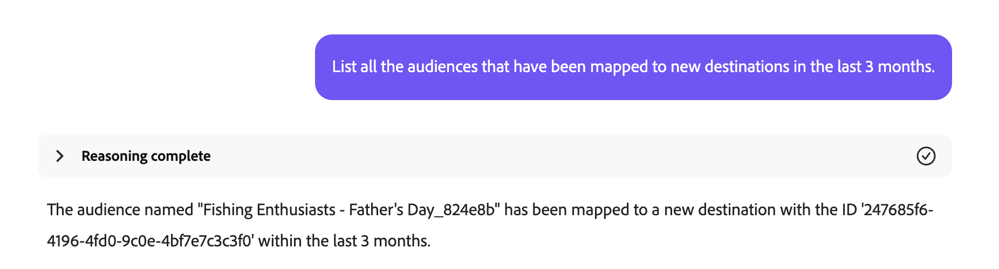
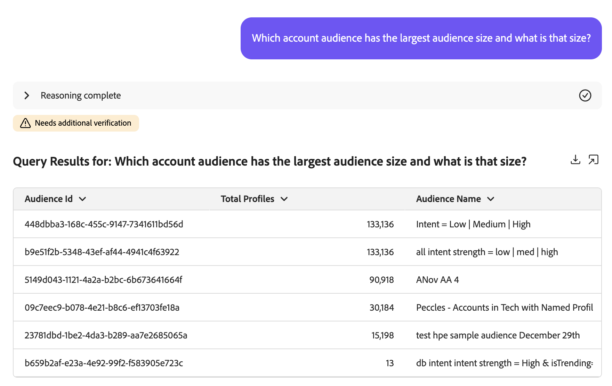
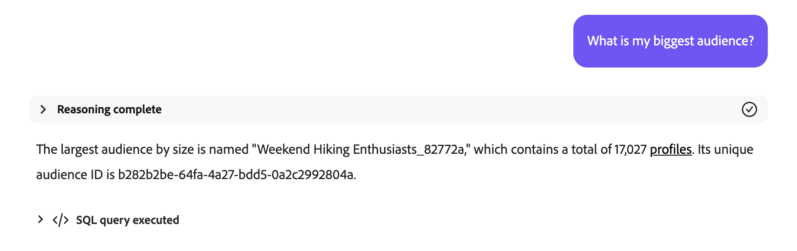
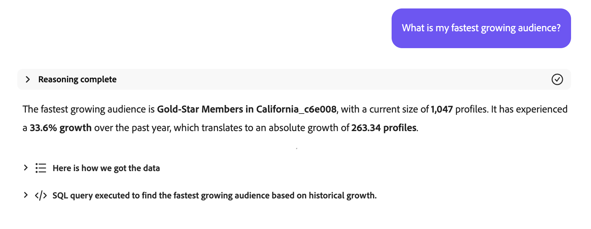
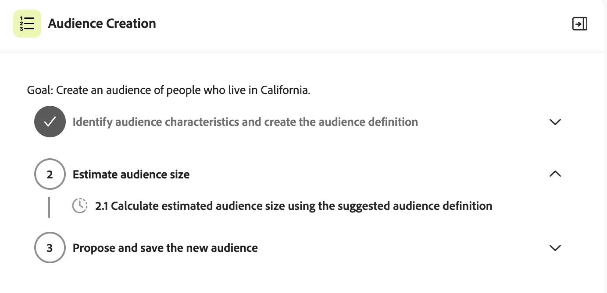
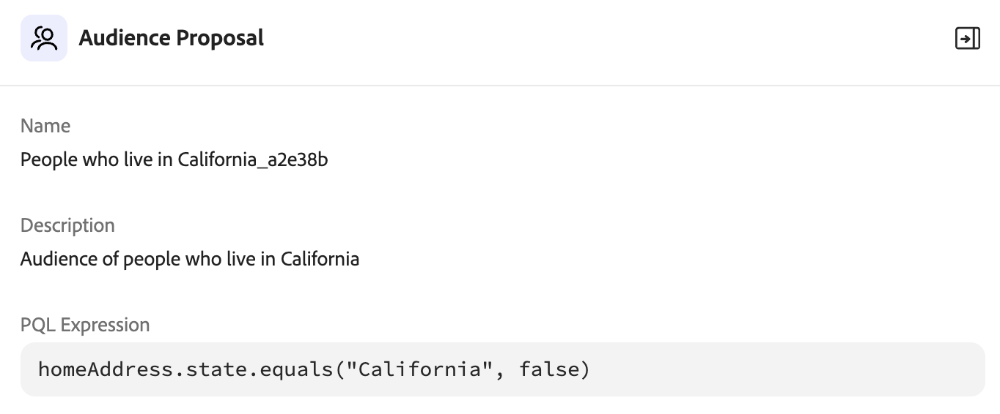

# Audience Agent

>[!AVAILABILITY]
>
>Audience Agent está disponible para todos los clientes que tienen acceso a AI Assistant. Sin embargo, necesitará los siguientes permisos para utilizar completamente las funciones de Audience Agent.
>
>**Ver segmentos**: Este permiso le permite utilizar Audience Agent para ver información de las audiencias directamente en el Asistente de IA.
>
>**Administrar segmentos**: El permiso Para permite usar Audience Agent para crear nuevas audiencias directamente en el Ayudante de IA.

Audience Agent le permite ver información sobre las audiencias, como la detección de cambios significativos en el tamaño de la audiencia, la detección de audiencias duplicadas, la exploración del inventario de audiencias y la recuperación del tamaño de las audiencias.

>[!SLIDE](audience-agent-overview)

## Casos de uso admitidos

El asistente de Audience Agent en IA es compatible con los siguientes casos de uso:

- Explorar la audiencia de forma conversacional
   - Buscar tamaños de audiencia de audiencias existentes
   - Busque audiencias basadas en atributos completos o parciales llamados
   - Detección de audiencias duplicadas
   - Descubra los campos XDM que puede utilizar para definir una audiencia
- Detectar cambios significativos en el tamaño de la audiencia
   - Esto le permite encontrar audiencias que han crecido o disminuido de repente, lo que le permite analizar mejor los posibles cambios del mercado
- Creación de públicos
   - Esta aptitud le permite crear una audiencia basada en los atributos y eventos determinados
   - Además, esta aptitud le permite calcular el tamaño potencial de una audiencia antes de crearla, lo que le permite iterar rápidamente en la audiencia más eficaz antes de que esté lista para activarse

<!--
  - Find your audience size and detect significant changes in audience size
  - This lets you find audiences that have suddenly grown or shrunk, letting you better analyze potential market changes
- Detect duplicate audiences
  - This lets you reduce redundancies with your created audiences
- Find audiences based on full or partial attributes named
  - This lets you more easily navigate through your audience inventory
- Discover XDM fields you can use to define an audience
  - This skill lets you more easily identify the right fields to use in your audience based on context and relevance 
-->

Audience Agent no **admite actualmente** la siguiente característica:

- Exploración de audiencias basada en objetivos
   - La exploración de audiencias basada en objetivos permite descubrir conjuntos de datos y perfiles relevantes alineados con un objetivo empresarial mediante la aplicación de modelos de aprendizaje automático como la tendencia a comprar o convertir.

Además, al utilizar Audience Agent, debe tener en cuenta las siguientes restricciones:

- Audience Agent necesita al menos 24 horas para procesar sus datos
   - Por ejemplo, **no puede** tener una consulta que busque datos en las últimas 24 horas. Tendrá que mirar dentro de las últimas 48 horas, como mínimo.
- Audience Agent solo admite los siguientes tipos de audiencia:
   - **People-based** audiences that are evaluated using batch segmentation
   - **Account-based** audiences for the following use cases:
      - Conversational audience exploration
      - Duplicate audience detection

## Sample prompts

The following examples demonstrate sample prompts and responses for the Audience Agent.

### Conversational audience exploration

Show me fields for affluent buyers.

+++ Respuesta


+++

Which audiences have not been activated or used in any campaign in the last 30 days?

+++ Respuesta


+++

List all the audiences that have been mapped to new destinations in the last 3 months.

+++ Respuesta



+++

Which account audience has the largest audience size and what is that size?

+++ Respuesta



+++

### Detect duplicate audiences

Do I have any audiences with identical or similar descriptions?

+++ Respuesta


+++

Identify audiences that have the same rules but have different names.

+++ Respuesta


+++

Show me all the audiences that have the same rules but different activation destinations.

+++ Respuesta


+++

Identify account audiences that have the same rules but have different names.

+++ Respuesta


+++

### Retrieve audience size

¿Cuál es el tamaño actual de mi audiencia &quot;Miembros Gold-star en California_f153e1&quot;?

+++ Respuesta


+++

¿Cuál es mi mayor audiencia?

+++ Respuesta



+++

### Detectar cambios significativos en el tamaño de la audiencia

¿Qué audiencias han aumentado en más de un 20 % en la última semana?

+++ Respuesta


+++

¿Qué audiencias han disminuido en más del 10 % en el último mes?

+++ Respuesta


+++

¿Cuál es mi audiencia que crece más rápido?

+++ Respuesta



+++

### Crear un público

>[!AVAILABILITY]
>
>Solo puede utilizar la habilidad Crear audiencia si forma parte del programa Explorador de Agent Orchestrator. Para obtener más información, póngase en contacto con el Servicio de atención al cliente de Adobe.

Al crear una audiencia con Audience Agent, el asistente de IA le guiará a través de un plan. Por ejemplo, puede pedir que &quot;se cree una audiencia compuesta por personas que viven en California&quot;. A continuación, AI Assistant enumera el plan que llevará a cabo para crear la audiencia.

+++ Respuesta


+++

Este plan consta de tres pasos:

1. [Identificación de características de audiencia](#identify)
2. [Calcular tamaño de audiencia](#estimate)
3. [Creación y persistencia de una nueva audiencia](#create)

#### Identificación de características de audiencia {#identify}

{align="center" width="80%"}

Después de aceptar el plan, el asistente de IA recopilará las características de la audiencia en función de su consulta inicial.

+++ Respuesta


Para esta consulta, AI Assistant genera el Profile Query Language (PQL) relevante que buscaría personas que viven en California. En este caso de uso, la consulta de PQL tendría el siguiente aspecto:

```sql
homeAddress.state.equals("California", false)
```

Para obtener más información sobre PQL, lea la [descripción general de PQL](https://experienceleague.adobe.com/en/docs/experience-platform/segmentation/pql/overview).

+++

Si la definición de audiencia del asistente de IA es correcta, puede aprobarla y pasar al siguiente paso.

#### Calcular tamaño de audiencia {#estimate}

{align="center" width="80%"}

Después de aprobar las características de audiencia identificadas, el asistente de IA calculará el tamaño de la audiencia potencial y los detalles de definición de audiencia.

+++ Respuesta


+++

Si el tamaño estimado parece correcto, puede aprobarlo y pasar al siguiente paso.

#### Crear y mantener nueva audiencia {#create}

{align="center" width="80%"}

Por último, si las características y el tamaño de la audiencia parecen correctos, puede aprobar o rechazar la creación de la audiencia.

+++ Respuesta

En primer lugar, puede revisar la audiencia propuesta a través de la cuadrícula de datos proporcionada.


Si la audiencia tiene el aspecto correcto, puede aceptar la propuesta seleccionando **[!UICONTROL Crear]** para finalizar la creación de la audiencia.



+++

Se crea la audiencia.

{align="center" width="80%"}

## Próximos pasos

Después de leer esta guía, debería comprender mejor Audience Agent y qué funciones admite. Para obtener más información sobre los agentes de Adobe Experience Platform, lea la [descripción general de Agent Orchestrator](./agent-orchestrator.md).

