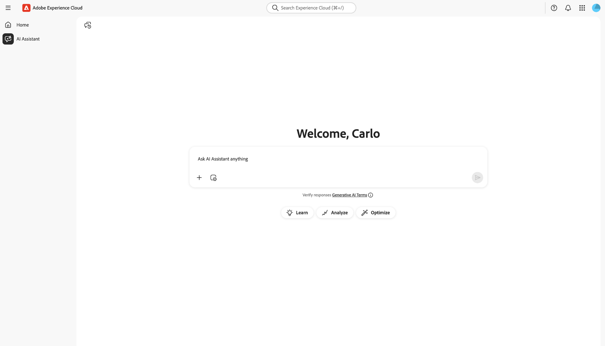
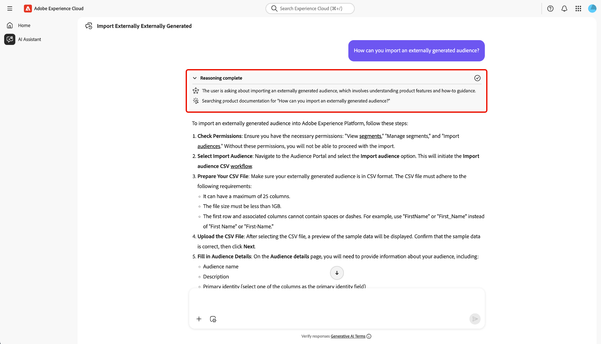
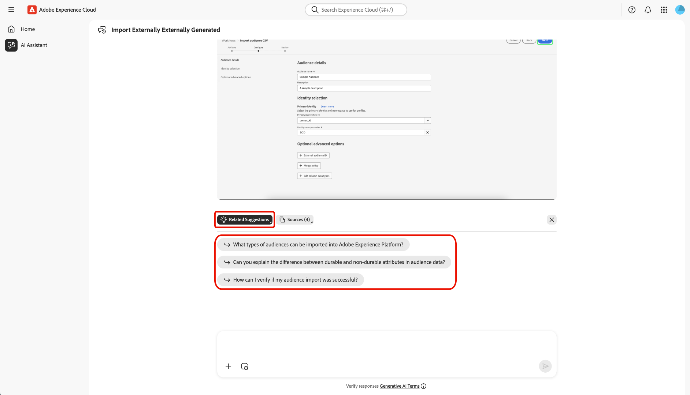
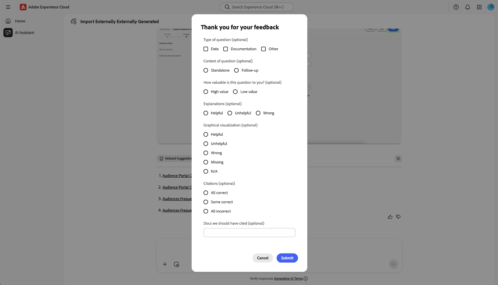
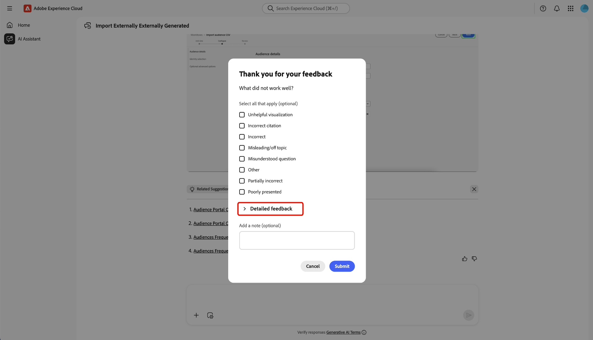
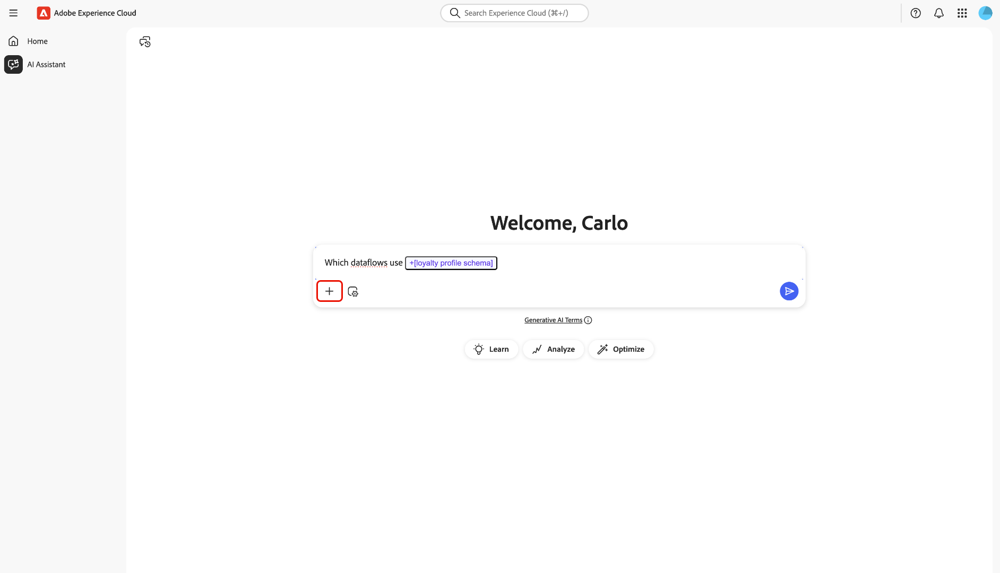
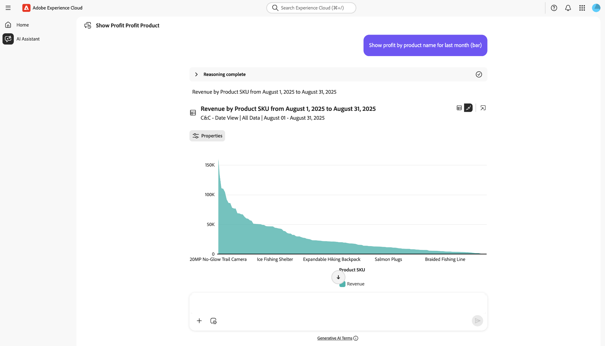
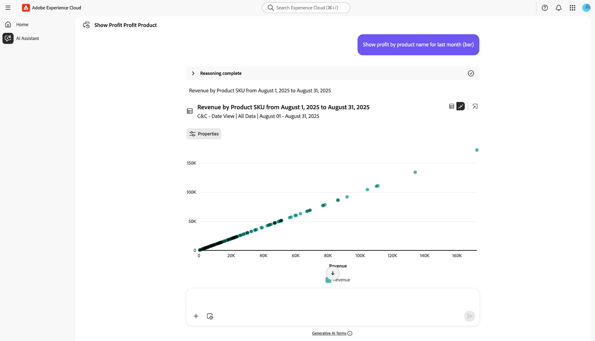

# Asistente de IA

>[!IMPORTANT]
>
>This document applies to AI Assistant (Next-Gen). For information on AI Assistant (Legacy), read the [AI Assistant UI guide](https://experienceleague.adobe.com/es/docs/experience-platform/ai-assistant/home) in the Adobe Experience Platform documentation.

Refer to the following table for a comparison of AI Assistant (Legacy) and AI Assistant (Next-Gen):

| Feature Area | AI Assistant (Legacy) | AI Assistant (Next-Gen) |
| --- | --- | --- |
| User experience | AI Assistant (Legacy) is available in a right-rail panel only. | AI Assistant (Next-Gen) is available in both right-rail panel and immersive full-screen experience. |
| Scope of capabilities | You can use AI Assistant (Legacy) for both product knowledge and operational insights. | You can use  AI Assistant (Next-Gen) for product knowledge, operational insights, as well as advanced agentic skills and multi-step task execution. |
| Platform architecture | AI Assistant (Legacy) is not built on the Agent Orchestrator stack. | AI Assistant (Next-Gen) is powered by [Adobe Experience Platform Agent Orchestrator](https://experienceleague.adobe.com/es/docs/experience-cloud-ai/experience-cloud-ai/agents/agent-orchestrator), enabling extensibility and advanced coordination across capabilities. |
| Application coverage | AI Assistant (Legacy) is an application-specific implementation. | You can use AI Assistant (Next-Gen) for a unified AI Assistant experience across all Adobe Experience Cloud applications. |
| Access and permission model | Application-scoped access model aligned to individual product boundaries. | All users get access to AI Assistant (Next-Gen) and associated Experience Platform agents. **Note**: <ul><li>**Adobe Experience Manager**: Your administrator must grant you the permission to access AI Assistant (Next-Gen) through the [Adobe Admin Console](https://helpx.adobe.com/es/enterprise/using/admin-console.html).</li><li>**Customer Journey Analytics**: Your administrator must grant you the permission to access AI Assistant through [Customer Journey Analytics Access Control](https://experienceleague.adobe.com/en/docs/analytics-platform/using/technotes/access-control?lang=en). This allows you to ask product knowledge and data insights questions. |

AI Assistant is an intelligent conversational, generative AI tool that will boost productivity and redefine work in Adobe Experience Platform-based Applications. You can use AI Assistant to access Adobe Experience Platform Agents and other AI capabilities.

Read this guide to learn how you can use AI Assistant.

>[!SLIDE](agent-orchestrator-ui)

## Acceso al Asistente de IA

There are several ways to access AI Assistant.

In the Experience Cloud home interface, select **[!UICONTROL AI Assistant]** from the left-navigation to launch a full-screen view of AI Assistant.

+++Seleccionar para ver

+++

You can also launch AI Assistant from the home pages of Experience Cloud applications such as Experience Platform, Adobe Journey Optimizer, and Customer Journey Analytics. Navigate to your product home page and then select the **AI Assistant icon** from the top header to launch the AI Assistant chat panel on the right rail.

+++Seleccionar para ver

+++

## Navigate the AI Assistant user interface

Read this section to learn how you can navigate the AI Assistant interface.

### Full screen view

The AI Assistant interface includes several key elements to help you interact effectively:

1. **[!UICONTROL Conversations]**: Select the **[!UICONTROL Conversations]** icon to start a new conversation and access recent conversations from your history. For more information, read the section on [conversations](#conversations).
2. **Input box**: Select the input box to enter questions and prompts for AI Assistant. For more information, read the section on [input features](#input-features).
3. **Data and object autocomplete**: - Select the plus icon to use data and object suggestion and autocomplete. When selected, you can use a pop-up window to select suggested entities. For more information, read the section on [data and object autocomplete](#autocomplete).
4. **Context setting**: - Select the Context setting icon to configure information sources for AI Assistant. You can use this tool to configure the application, sandbox, and dataview that AI Assistant references in order to answer your query. For more information, read the section on [context setting](#context-setting).
5. **Descubrimiento**: - Seleccione **[!UICONTROL Aprender]**, **[!UICONTROL Analizar]** y **[!UICONTROL Optimizar]** para ver las consultas de muestra que puede usar para comenzar. Para obtener más información, lea la sección sobre [avisos de detección](#discoverability-prompts).

### Vista de carril

La vista de carril proporciona acceso rápido al chat, las peticiones de información, las actualizaciones, las conversaciones y los controles de interfaz en un panel compacto.

1. **[!UICONTROL Chat]**: selecciona **[!UICONTROL Chat]** en el encabezado para volver a tu conversación en el caso de que hayas salido para acceder a diferentes elementos de la interfaz.
1. **[!UICONTROL Descubrimiento]**: seleccione **[!UICONTROL Descubrimiento]** para ver una lista de los mensajes del Asistente de inteligencia artificial organizados por categoría. Puede utilizar estas indicaciones preconfiguradas para rellenar el chat. Además, puede modificar las indicaciones sugeridas para que se ajusten a su caso de uso particular.
1. **[!UICONTROL Novedades]**: selecciona **[!UICONTROL Novedades]** para ver una lista de las últimas actualizaciones disponibles para el Asistente de IA.
1. **[!UICONTROL Conversaciones]**: selecciona el icono **[!UICONTROL Conversaciones]** para iniciar una nueva conversación y acceder a las conversaciones recientes de tu historial. Para obtener más información, lea la sección sobre [conversaciones](#conversations).
1. **Vista de pantalla completa**: selecciona el icono **[!UICONTROL Vista de pantalla completa]** para cambiar la interfaz del asistente de IA del carril derecho al modo de pantalla completa.
1. **Autocompletar datos y objetos**: seleccione el icono de signo + para usar la sugerencia y autocompletar datos y objetos. Una vez seleccionada, puede utilizar una ventana emergente para seleccionar las entidades sugeridas. Para obtener más información, lea la sección sobre [autocompletar datos y objetos](#autocomplete).
1. **Configuración de contexto**: seleccione el icono Configuración de contexto para configurar las fuentes de información del Asistente de IA. Puede utilizar esta herramienta para configurar la aplicación, la zona protegida y la vista de datos a los que hace referencia el Asistente de IA para responder a la consulta. Para obtener más información, lea la sección sobre [configuración de contexto](#context-setting).

## Guía de IU del asistente de IA

Esta sección proporciona información general sobre las principales funciones y opciones de navegación de la interfaz de usuario del asistente de IA. Explica cómo acceder al Asistente de IA, describe el diseño y los controles tanto en la pantalla completa como en las vistas de carril, e introduce herramientas clave como conversaciones, funciones de entrada, autocompletar, configuración de contexto y peticiones de información. Las siguientes secciones ofrecen instrucciones detalladas sobre el uso de estas funciones para interactuar con el asistente de IA y sacar el máximo partido de la experiencia.

### Mensajes de detección {#discovery-prompts}

Puede utilizar la función de descubrimiento del asistente de IA para ver una lista de los temas generales, agrupados en entidades, que admite el asistente de IA. Las solicitudes de detección son diferentes en función del punto de inicio.

>[!BEGINTABS]

>[!TAB Usar detección desde la vista de pantalla completa]

Desde la vista de pantalla completa, las solicitudes de detección se agrupan en tres categorías: **[!UICONTROL Aprender]**, **[!UICONTROL Analizar]** y **[!UICONTROL Optimizar]**.

Para usar las indicaciones de detección para avanzar en el conocimiento del producto, seleccione **[!UICONTROL Aprender]** y, a continuación, seleccione una solicitud en la ventana desplegable que aparece.

>[!TAB Usar detección desde la vista de carril]

Seleccione **[!UICONTROL Descubrimiento]** de la vista de carril para acceder a una amplia lista de mensajes de detección que puede utilizar para empezar y rellenar el chat con el Asistente de IA.

>[!ENDTABS]

Seleccione un mensaje para rellenar el cuadro de entrada. Desde aquí, puede editar el mensaje para que se ajuste a su caso de uso particular. Cuando esté listo, seleccione el icono de envío a la derecha para enviar la consulta.

## Interactuar con respuestas

### Comprobar el proceso de razonamiento {#reasoning}

A continuación, el asistente de IA consulta su base de conocimiento y calcula una respuesta. Después de unos momentos, AI Assistant devuelve una respuesta, incluidas opciones para profundizar en su proceso de razonamiento, sugerencias relacionadas, fuentes de información y herramientas de comentarios.

Para comprender mejor el proceso de razonamiento subyacente, seleccione **[!UICONTROL Razonamiento completado]**.

La ventana *[!UICONTROL Razonamiento completado]* se amplía para mostrar un resumen de su solicitud y detalles sobre cómo se escribió la respuesta.

### Usar sugerencias relacionadas

A continuación, desplácese hacia abajo hasta la parte inferior de la respuesta y seleccione **[!UICONTROL Sugerencias relacionadas]** para recibir una lista de preguntas relacionadas con la consulta inicial. Puede utilizar estas indicaciones para continuar con la conversación con el asistente de IA.

### Ver fuentes

Para comprobar la respuesta del Asistente de inteligencia artificial, seleccione **[!UICONTROL Sources]** para ver una lista de fuentes de información a las que hizo referencia el Asistente de inteligencia artificial al calcular su respuesta.

### Proporcionar comentarios

Puede proporcionar comentarios sobre su experiencia con el asistente de IA mediante las opciones que se proporcionan con la respuesta.

Para proporcionar comentarios, seleccione los pulgares hacia arriba o hacia abajo después de recibir una respuesta del asistente de IA y, a continuación, introduzca sus comentarios en el cuadro de texto proporcionado.

>[!BEGINTABS]

>[!TAB Pulgares arriba]

Seleccione **[!UICONTROL Pulgares arriba]** para proporcionar comentarios positivos. Si lo desea, puede seleccionar una opción de una lista de comentarios positivos o utilizar el cuadro de entrada para introducir sus propios comentarios específicos.

+++Seleccionar para ver

También puedes seleccionar **[!UICONTROL Comentarios detallados]** para obtener más información. Cuando termine, seleccione **[!UICONTROL Enviar]**.

+++

>[!TAB Pulgares hacia abajo]

Seleccione **[!UICONTROL Pulgares hacia abajo]** para proporcionar comentarios constructivos. Si lo desea, puede seleccionar una opción de una lista de comentarios constructivos o utilizar el cuadro de entrada para introducir sus propios comentarios específicos.

+++Seleccionar para ver

Del mismo modo, también puede seleccionar **[!UICONTROL Comentarios detallados]** para obtener más información. Cuando termine, seleccione **[!UICONTROL Enviar]**.

+++

>[!ENDTABS]

### Uso de la función de vista dividida

Si la respuesta del asistente de IA incluye una imagen, puede seleccionar el icono de ruta para iniciar un modo de vista dividida. Esto le permite leer la respuesta completa del asistente de IA con la imagen contextual a la derecha.

### Conversaciones

Puede usar el panel *[!UICONTROL Todas las conversaciones]* para restablecer y volver a visitar las conversaciones con el Asistente de inteligencia artificial. Seleccione el icono **[!UICONTROL Conversaciones]** para ver la ventana *[!UICONTROL Todas las conversaciones]*.

Para volver a una conversación anterior, seleccione el tema de conversación en la lista proporcionada.

Para iniciar una nueva conversación, selecciona **[!UICONTROL Nueva conversación]**.

### Configuración de contexto {#context-setting}

Use la característica de configuración de contexto del Asistente de IA para configurar la **aplicación**, la **zona protegida** y la **vista de datos** a las que el Asistente de IA hace referencia para responder a su consulta. Para acceder a la configuración de contexto, seleccione el icono **[!UICONTROL Configuración de contexto]** del cuadro de entrada.

Aparece la ventana emergente *[!UICONTROL Respuesta de...]*. Utilice esta ventana para configurar los orígenes de información que desea utilizar y, a continuación, seleccione **[!UICONTROL Establecer contexto]**.

| Fuente de información | Descripción | Ejemplos |
| --- | --- | --- |
| Aplicación | La aplicación de Experience Cloud a la que pertenece la consulta. | Experience Platform, Journey Optimizer, Customer Journey Analytics, etc. |
| Zona protegida | La zona protegida que contiene los conjuntos de datos o la información a la que pertenece su consulta. | Producción (VA7), Desarrollo |
| Dataview | Cuando utiliza el asistente de IA con Customer Journey Analytics, la configuración de vista de datos ayuda a Data Insights Agent a comprender lo siguiente: <ul><li>Qué conjuntos de datos consultar</li><li>Qué componentes de datos están disponibles</li><li>Estructurar las respuestas sobre los datos</li><li>Qué visualizaciones crear en Analysis Workspace</li></ul> | |

### Autocompletar datos y objetos

Puede utilizar la función de autocompletar para recibir una lista de los objetos de datos que existen en su zona protegida. Para utilizar el completado automático, escriba el icono de signo más (+) en la consulta. Como alternativa, también puede seleccionar el icono de signo más (+) situado en la parte inferior del cuadro de entrada de texto. Aparece una ventana con una lista de los objetos de datos recomendados de la zona protegida.

### Verificar respuestas

Existen varias formas de verificar las respuestas desde el Asistente de IA. Seleccione **[!UICONTROL Término de consulta coincidente con objetos]** para ver un resumen de los términos de la consulta que coincidieron con objetos específicos de su organización.

Seleccione **[!UICONTROL Aquí es donde obtuve los resultados]** para ver una explicación detallada y paso a paso de cómo el Asistente de IA llegó a su respuesta. Además, también puede ver la consulta SQL que se ejecutó para responder a su pregunta. Esta consulta es de solo lectura y no se admite para su uso en el servicio de consultas.

### Configuración de visualización de datos

Puede utilizar las funcionalidades de visualización de datos de AI Assistant para comprender mejor sus datos. También puede especificar el tipo de gráfico que desea utilizar en la consulta. Por ejemplo, envíe una consulta que diga: **&quot;Mostrar beneficio por nombre de producto del último mes (barra)&quot;** para recibir un gráfico de barras de ganancias del último mes, organizado por nombre de producto.

A continuación, seleccione **[!UICONTROL Propiedades]** para cambiar el tipo de gráfico y configurar los valores de los ejes X e Y.

El asistente de IA admite varios tipos de gráficos para la visualización de datos. Puede interactuar con todos los tipos de gráficos pasando el puntero sobre los datos.

>[!BEGINTABS]

>[!TAB Line]

Para ver un gráfico de líneas, seleccione **[!UICONTROL Propiedades]** y luego seleccione **[!UICONTROL Línea]**.

>[!TAB Área]

To view an area graph, select **[!UICONTROL Properties]** and then select **[!UICONTROL Area]**.

>[!TAB Scatter]

To view a scatter graph, select **[!UICONTROL Properties]** and then select **[!UICONTROL Scatter]**.

>[!TAB Anillo]

To view a donut graph, select **[!UICONTROL Properties]** and then select **[!UICONTROL Donut]**.

>[!ENDTABS]
