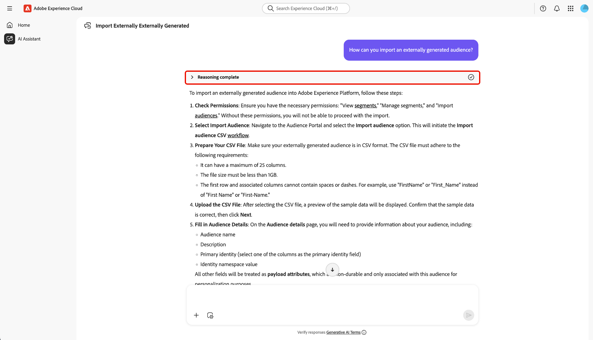
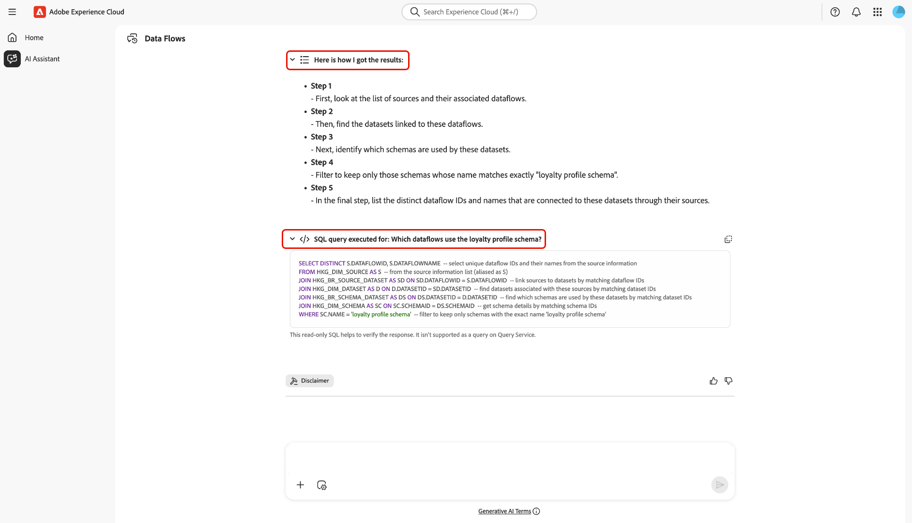
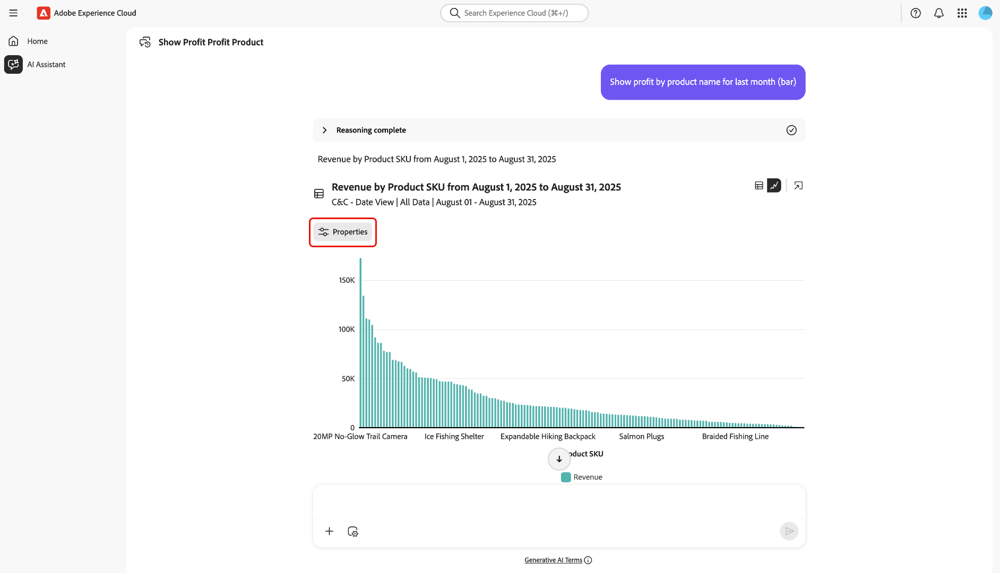
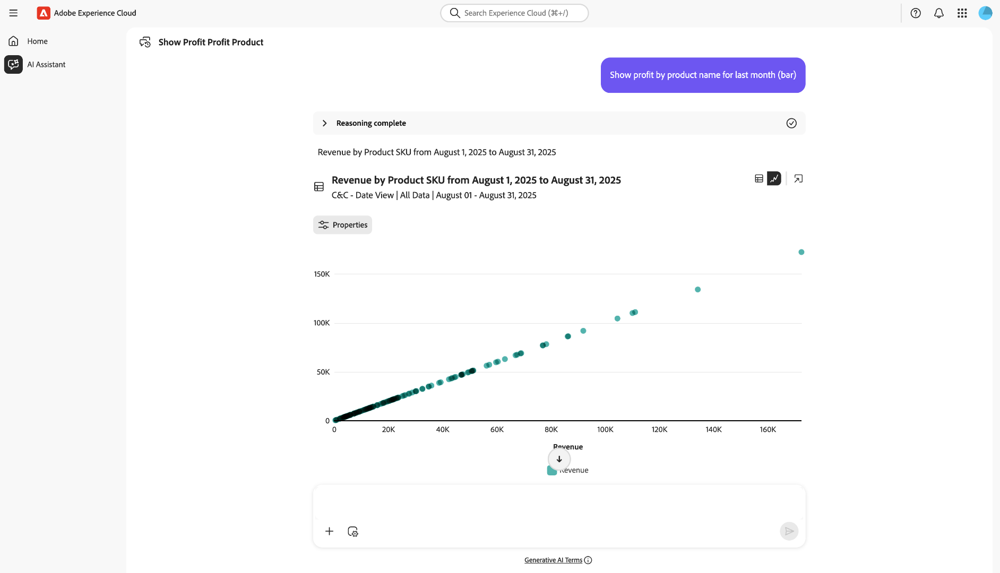

# Asistente de IA

El asistente de IA es una herramienta inteligente de IA conversacional y generativa que impulsará la productividad y redefinirá el trabajo en aplicaciones basadas en Adobe Experience Platform. Puede utilizar el Asistente de IA para acceder a los agentes de Adobe Experience Platform y otras funciones de IA.

Lea esta guía para aprender a utilizar el Asistente para IA.

## Acceder al asistente de IA

Existen varias formas de acceder a AI Assistant.

En la interfaz de inicio de Experience Cloud, seleccione **[!UICONTROL Asistente de IA]** en el panel de navegación izquierdo para iniciar una vista de pantalla completa del Asistente de IA.

+++Seleccionar para ver

+++

También puede iniciar AI Assistant desde las páginas de inicio de aplicaciones de Experience Cloud como Experience Platform, Adobe Journey Optimizer y Customer Journey Analytics. Vaya a la página de inicio del producto y, a continuación, seleccione el **icono del asistente de IA** en el encabezado superior para iniciar el panel de chat del asistente de IA en el carril derecho.

+++Seleccionar para ver

+++

## Navegar por la interfaz de usuario del asistente de IA

Lea esta sección para aprender a desplazarse por la interfaz del asistente de IA.

### Vista de pantalla completa

La interfaz del asistente de IA incluye varios elementos clave para ayudarle a interactuar de forma eficaz:

1. **[!UICONTROL Conversaciones]**: selecciona el icono **[!UICONTROL Conversaciones]** para iniciar una nueva conversación y acceder a las conversaciones recientes de tu historial. Para obtener más información, lea la sección sobre [conversaciones](#conversations).
2. **Cuadro de entrada**: seleccione el cuadro de entrada para escribir preguntas y peticiones de datos para el Ayudante de IA. Para obtener más información, lea la sección sobre [características de entrada](#input-features).
3. **Autocompletar datos y objetos**: - Seleccione el icono de signo + para usar la sugerencia y autocompletar datos y objetos. Una vez seleccionada, puede utilizar una ventana emergente para seleccionar las entidades sugeridas. Para obtener más información, lea la sección sobre [autocompletar datos y objetos](#autocomplete).
4. **Configuración de contexto**: - Seleccione el icono Configuración de contexto para configurar las fuentes de información para el Asistente de IA. Puede utilizar esta herramienta para configurar la aplicación, la zona protegida y la vista de datos a los que hace referencia el Asistente de IA para responder a la consulta. Para obtener más información, lea la sección sobre [configuración de contexto](#context-setting).
5. **Descubrimiento**: - Seleccione **[!UICONTROL Aprender]**, **[!UICONTROL Analizar]** y **[!UICONTROL Optimizar]** para ver las consultas de muestra que puede usar para comenzar. Para obtener más información, lea la sección sobre [avisos de detección](#discoverability-prompts).

### Vista de carril

La vista de carril proporciona acceso rápido al chat, las peticiones de información, las actualizaciones, las conversaciones y los controles de interfaz en un panel compacto.

1. **[!UICONTROL Chat]**: selecciona **[!UICONTROL Chat]** en el encabezado para volver a tu conversación en el caso de que hayas salido para acceder a diferentes elementos de la interfaz.
2. **[!UICONTROL Descubrimiento]**: seleccione **[!UICONTROL Descubrimiento]** para ver una lista de los mensajes del Asistente de inteligencia artificial organizados por categoría. Puede utilizar estas indicaciones preconfiguradas para rellenar el chat. Además, puede modificar las indicaciones sugeridas para que se ajusten a su caso de uso particular.
3. **[!UICONTROL Novedades]**: selecciona **[!UICONTROL Novedades]** para ver una lista de las últimas actualizaciones disponibles para el Asistente de IA.
4. **[!UICONTROL Conversaciones]**: selecciona el icono **[!UICONTROL Conversaciones]** para iniciar una nueva conversación y acceder a las conversaciones recientes de tu historial. Para obtener más información, lea la sección sobre [conversaciones](#conversations).
5. **Vista de pantalla completa**: selecciona el icono **[!UICONTROL Vista de pantalla completa]** para cambiar la interfaz del asistente de IA del carril derecho al modo de pantalla completa.
6. **Autocompletar datos y objetos**: seleccione el icono de signo + para usar la sugerencia y autocompletar datos y objetos. Una vez seleccionada, puede utilizar una ventana emergente para seleccionar las entidades sugeridas. Para obtener más información, lea la sección sobre [autocompletar datos y objetos](#autocomplete).
7. **Configuración de contexto**: seleccione el icono Configuración de contexto para configurar las fuentes de información del Asistente de IA. Puede utilizar esta herramienta para configurar la aplicación, la zona protegida y la vista de datos a los que hace referencia el Asistente de IA para responder a la consulta. Para obtener más información, lea la sección sobre [configuración de contexto](#context-setting).

## Guía de IU del asistente de IA

Esta sección proporciona información general sobre las principales funciones y opciones de navegación de la interfaz de usuario del asistente de IA. Explica cómo acceder al Asistente de IA, describe el diseño y los controles tanto en la pantalla completa como en las vistas de carril, e introduce herramientas clave como conversaciones, funciones de entrada, autocompletar, configuración de contexto y peticiones de información. Las siguientes secciones ofrecen instrucciones detalladas sobre el uso de estas funciones para interactuar con el asistente de IA y sacar el máximo partido de la experiencia.

### Mensajes de detección

Puede utilizar la función de descubrimiento del asistente de IA para ver una lista de los temas generales, agrupados en entidades, que admite el asistente de IA. Las solicitudes de detección son diferentes en función del punto de inicio.

>[!BEGINTABS]

>[!TAB Usar detección desde la vista de pantalla completa]

Desde la vista de pantalla completa, las solicitudes de detección se agrupan en tres categorías: **[!UICONTROL Aprender]**, **[!UICONTROL Analizar]** y **[!UICONTROL Optimizar]**.

Para usar las indicaciones de detección para avanzar en el conocimiento del producto, seleccione **[!UICONTROL Aprender]** y, a continuación, seleccione una solicitud en la ventana desplegable que aparece.

>[!TAB Usar detección desde la vista de carril]

Seleccione **[!UICONTROL Descubrimiento]** de la vista de carril para acceder a una amplia lista de mensajes de detección que puede utilizar para empezar y rellenar el chat con el Asistente de IA.

>[!ENDTABS]

Seleccione un mensaje para rellenar el cuadro de entrada. Desde aquí, puede editar el mensaje para que se ajuste a su caso de uso particular. Cuando esté listo, seleccione el icono de envío a la derecha para enviar la consulta.

## Interactuar con respuestas

### Comprobar el proceso de razonamiento {#reasoning}

A continuación, el asistente de IA consulta su base de conocimiento y calcula una respuesta. Después de unos momentos, AI Assistant devuelve una respuesta, incluidas opciones para profundizar en su proceso de razonamiento, sugerencias relacionadas, fuentes de información y herramientas de comentarios.

Para comprender mejor el proceso de razonamiento subyacente, seleccione **[!UICONTROL Razonamiento completado]**.

La ventana *[!UICONTROL Razonamiento completado]* se amplía para mostrar un resumen de su solicitud y detalles sobre cómo se escribió la respuesta.

### Usar sugerencias relacionadas

A continuación, desplácese hacia abajo hasta la parte inferior de la respuesta y seleccione **[!UICONTROL Sugerencias relacionadas]** para recibir una lista de preguntas relacionadas con la consulta inicial. Puede utilizar estas indicaciones para continuar con la conversación con el asistente de IA.

### Ver orígenes

Para comprobar la respuesta del Asistente de inteligencia artificial, seleccione **[!UICONTROL Sources]** para ver una lista de fuentes de información a las que hizo referencia el Asistente de inteligencia artificial al calcular su respuesta.

### Proporcionar comentarios

Puede proporcionar comentarios sobre su experiencia con el asistente de IA mediante las opciones que se proporcionan con la respuesta.

Para proporcionar comentarios, seleccione los pulgares hacia arriba o hacia abajo después de recibir una respuesta del asistente de IA y, a continuación, introduzca sus comentarios en el cuadro de texto proporcionado.

>[!BEGINTABS]

>[!TAB Pulgares arriba]

Seleccione **[!UICONTROL Pulgares arriba]** para proporcionar comentarios positivos. Si lo desea, puede seleccionar una opción de una lista de comentarios positivos o utilizar el cuadro de entrada para introducir sus propios comentarios específicos.

+++Seleccionar para ver

También puedes seleccionar **[!UICONTROL Comentarios detallados]** para obtener más información. Cuando termine, seleccione **[!UICONTROL Enviar]**.

+++

>[!TAB Pulgares hacia abajo]

Seleccione **[!UICONTROL Pulgares hacia abajo]** para proporcionar comentarios constructivos. Si lo desea, puede seleccionar una opción de una lista de comentarios constructivos o utilizar el cuadro de entrada para introducir sus propios comentarios específicos.

+++Seleccionar para ver

Del mismo modo, también puede seleccionar **[!UICONTROL Comentarios detallados]** para obtener más información. Cuando termine, seleccione **[!UICONTROL Enviar]**.

+++

>[!ENDTABS]

### Uso de la función de vista dividida

Si la respuesta del asistente de IA incluye una imagen, puede seleccionar el icono de ruta para iniciar un modo de vista dividida. Esto le permite leer la respuesta completa del asistente de IA con la imagen contextual a la derecha.

### Conversaciones

Puede usar el panel *[!UICONTROL Todas las conversaciones]* para restablecer y volver a visitar las conversaciones con el Asistente de inteligencia artificial. Seleccione el icono **[!UICONTROL Conversaciones]** para ver la ventana *[!UICONTROL Todas las conversaciones]*.

Para volver a una conversación anterior, seleccione el tema de conversación en la lista proporcionada.

Para iniciar una nueva conversación, selecciona **[!UICONTROL Nueva conversación]**.

### Configuración de contexto {#context-setting}

Use la característica de configuración de contexto del Asistente de IA para configurar la **aplicación**, la **zona protegida** y la **vista de datos** a las que el Asistente de IA hace referencia para responder a su consulta. Para acceder a la configuración de contexto, seleccione el icono **[!UICONTROL Configuración de contexto]** del cuadro de entrada.

Aparece la ventana emergente *[!UICONTROL Respuesta de...]*. Utilice esta ventana para configurar los orígenes de información que desea utilizar y, a continuación, seleccione **[!UICONTROL Establecer contexto]**.

| Fuente de información | Descripción | Ejemplos |
| --- | --- | --- |
| Aplicación | La aplicación de Experience Cloud a la que pertenece la consulta. | Experience Platform, Journey Optimizer, Customer Journey Analytics, etc. |
| Sandbox | La zona protegida que contiene los conjuntos de datos o la información a la que pertenece su consulta. | Producción (VA7), Desarrollo |
| Dataview | Cuando utiliza el asistente de IA con Customer Journey Analytics, la configuración de vista de datos ayuda a Data Insights Agent a comprender lo siguiente: <ul><li>Qué conjuntos de datos consultar</li><li>Qué componentes de datos están disponibles</li><li>Estructurar las respuestas sobre los datos</li><li>Qué visualizaciones crear en Analysis Workspace</li></ul> |

### Autocompletar datos y objetos

Puede utilizar la función de autocompletar para recibir una lista de los objetos de datos que existen en su zona protegida. Para utilizar el completado automático, escriba el icono de signo más (+) en la consulta. Como alternativa, también puede seleccionar el icono de signo más (+) situado en la parte inferior del cuadro de entrada de texto. Aparece una ventana con una lista de los objetos de datos recomendados de la zona protegida.

### Verificar respuestas

Existen varias formas de verificar las respuestas desde el Asistente de IA. Seleccione **[!UICONTROL Término de consulta coincidente con objetos]** para ver un resumen de los términos de la consulta que coincidieron con objetos específicos de su organización.

Seleccione **[!UICONTROL Aquí es donde obtuve los resultados]** para ver una explicación detallada y paso a paso de cómo el Asistente de IA llegó a su respuesta. Además, también puede ver la consulta SQL que se ejecutó para responder a su pregunta. Esta consulta es de solo lectura y no se admite para su uso en el servicio de consultas.

### Configuración de visualización de datos

Puede utilizar las funcionalidades de visualización de datos de AI Assistant para comprender mejor sus datos. También puede especificar el tipo de gráfico que desea utilizar en la consulta. Por ejemplo, envíe una consulta que diga: **&quot;Mostrar beneficio por nombre de producto del último mes (barra)&quot;** para recibir un gráfico de barras de ganancias del último mes, organizado por nombre de producto.

A continuación, seleccione **[!UICONTROL Propiedades]** para cambiar el tipo de gráfico y configurar los valores de los ejes X e Y.

El asistente de IA admite varios tipos de gráficos para la visualización de datos. Puede interactuar con todos los tipos de gráficos pasando el puntero sobre los datos.

>[!BEGINTABS]

>[!TAB Línea]

Para ver un gráfico de líneas, seleccione **[!UICONTROL Propiedades]** y luego seleccione **[!UICONTROL Línea]**.

>[!TAB Área]

Para ver un gráfico de áreas, seleccione **[!UICONTROL Propiedades]** y, a continuación, seleccione **[!UICONTROL Área]**.

>[!TAB Dispersión]

Para ver un gráfico de dispersión, selecciona **[!UICONTROL Propiedades]** y luego selecciona **[!UICONTROL Dispersión]**.

>[!TAB Anillo]

Para ver un gráfico de anillo, selecciona **[!UICONTROL Propiedades]** y luego selecciona **[!UICONTROL Anillo]**.

>[!ENDTABS]