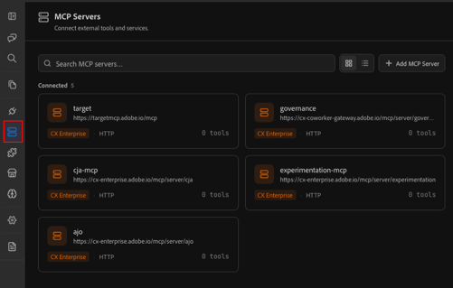
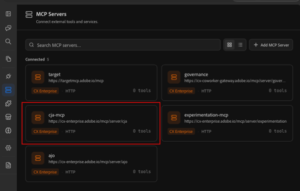
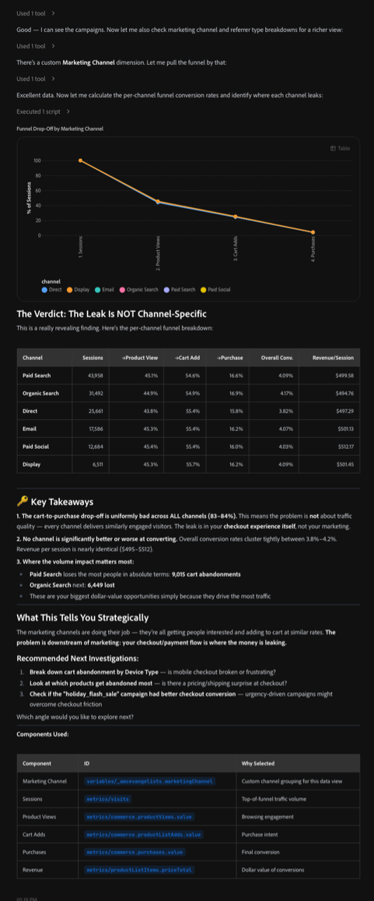

# Realizar el análisis de datos de Customer Journey Analytics con Coworker

>[!AVAILABILITY]
>
>La funcionalidad descrita en este artículo se encuentra en la fase de prueba limitada de la versión y es posible que aún no esté disponible en su entorno. Esta nota se eliminará cuando la funcionalidad esté disponible de forma general. Para obtener información sobre el proceso de lanzamiento de Customer Journey Analytics, consulte [lanzamientos de características de Customer Journey Analytics](https://experienceleague.adobe.com/es/docs/analytics-platform/using/releases/latest).

Adobe CX Enterprise Coworker Chat puede realizar análisis de datos avanzados que anteriormente solo eran posibles en Analysis Workspace. El chat de compañeros accede a los datos de sus vistas de datos de Customer Journey Analytics, lo que le permite explorar esos datos y obtener respuestas a las preguntas en lenguaje natural.

Antes de comenzar el análisis, acceda al chat de Coworker iniciando sesión en su cuenta de CX Enterprise y, a continuación, asegúrese de que el servidor MCP de Customer Journey Analytics esté conectado.

## Acceso a Coworker Chat

1. Vaya a https://coworker.experience.adobe.io/chat/.

1. Inicie sesión en [Adobe CX Enterprise](https://experience.adobe.com) con sus credenciales de Adobe ID.

1. ¿Entonces qué?

## Conexión del servidor MCP de Customer Journey Analytics

1. En Compañero de trabajo, seleccione el icono MCP en el carril izquierdo.

   

1. Asegúrese de que [!UICONTROL **cja-mcp**] esté disponible en su lista de servidores MCP conectados.

   

1. (Condicional) Si [!UICONTROL **cja-mcp**] aún no está conectado, seleccione [!UICONTROL **Agregar servidor MCP**], especifique cja en el campo [!UICONTROL **Nombre de servidor**] y selecciónelo cuando aparezca, luego seleccione [!UICONTROL **Agregar servidor**].

## Conéctese a la vista de datos correcta

<!--I did this. Do users need to?-->

Una vista de datos es un contenedor de Customer Journey Analytics que determina cómo se interpretan los datos.

Es posible que tenga acceso a varias vistas de datos en Customer Journey Analytics, cada una de las cuales contiene diferentes dimensiones y métricas que el colaborador puede utilizar al analizar los datos.

Indique a su Compañero de trabajo los tipos de preguntas que desea responder y pregúntele a qué vistas de datos tiene acceso que sería mejor para proporcionar esa información.

**Usted:**
> Me interesa saber dónde caen los clientes en el recorrido de clientes. ¿A qué vistas de datos de Customer Journey Analytics tengo acceso que puedan responder a esta pregunta?

**Respuesta de chat de compañero:**
> Tiene acceso a tres vistas de datos. La vista de datos `Customer lifecycle` contiene las siguientes dimensiones y métricas, que serían las mejores para responder a su pregunta.

**Usted:**
> Genial, vamos a usar esa vista de datos.

**Respuesta de chat de compañero:**
> De acuerdo, usaré la vista de datos de `Customer lifecycle` para responder preguntas futuras en esta sesión de chat.

## Caso de uso: Encuentre el lugar de entrega de los clientes

Puede pedirle a Coworker Chat que use sus datos para analizar cualquier pregunta comercial.

Por ejemplo, como administrador de marketing, comerciante o líder de crecimiento, es posible que desee comprender dónde abandonan los clientes la ruta de compra, por qué lo hicieron y qué se puede hacer para aumentar las tasas de conversión.

>[!NOTE]
>
>Las figuras a continuación son datos ilustrativos de muestra para un retailer ficticio, TechPulse Electronics, utilizado para mostrar la forma de la conversación.

### Los tipos de preguntas que puede hacer

No necesita saber qué es una &quot;visualización de abandonos&quot; o qué métrica se incluye en qué ranura. En su lugar, describa el resultado que le interesa en lenguaje sencillo:

* &quot;¿Dónde estamos perdiendo gente en el camino a comprar?&quot;
* &quot;¿Cuál es mi funnel de conversión completo, de vista de producto a cierre de compra?&quot;
* &quot;¿Qué canales de marketing pierden más entre el carro de compras y la compra?&quot;
* &quot;¿El abandono del carro de compras es peor en móviles o equipos de escritorio?&quot;
* &quot;¿La gente de las redes sociales pagadas se convierte de forma diferente que la gente del correo electrónico?&quot;

### La conversación

#### &#x200B;1. Comience con la pregunta empresarial

**Usted:**
> ¿Dónde estamos perdiendo gente en el camino a comprar?

**Respuesta de chat de compañero:**

Tenga en cuenta que Coworker Chat elige la visualización correcta, secuencia los puntos de contacto e incluso añade los pasos siguientes recomendados.

>
> 
>Esta es una pregunta de funnel. Permítanme ejecutar funnel de conversión para ver dónde se producen los descensos en la ruta de compra.
>
>
>
>Aquí es donde estás perdiendo gente:
>
>| Paso de funnel | Count | Conversión a siguiente | Entrega |
>| --- | --- | --- | --- |
>| Sessions | 137,476 | 45,0% ve un producto | El 55% se va sin explorar los productos |
>| Vistas del producto | 61,845 | 55,0 % añadir al carrito | 45% de exploración, pero no agregar |
>| El carro agrega | 34,045 | 16,4% de compra | 83,6 % abandonan el carro |
>| Compras | 5,582 | — | — |
>
>**El gran hallazgo: el carro de compras es tu mayor fuga**
>
>28.463 personas agregan artículos al carro de compras, pero nunca completan la compra. Esto representa una tasa de entrega del 83,6% del carro de compras, que es, con mucho, el mayor punto de fallo.
>
>Para ponerlo en términos de dólares, convertir solo un 10% más de esas adiciones al carro de compras agregaría unas 2,846 compras. A la escala de datos actual, eso es un ingreso potencialmente significativo que queda sobre la mesa.
>
>**Lo que esto le dice sobre las prioridades:**
>
>| Prioridad | Problema | Escala de oportunidad |
>| --- | --- | --- |
>| #1 | Abandono del carro de compras (caída del 83,6 %) | 28.463 compradores perdidos |
>| #2 | Sesión a vista de producto (55 % no examinar nunca) | 75.631 sesiones sin participación del producto |
>| #3 | Vista del producto al carro de compras (el 45 % no agrega) | 27.800 interesados pero no comprometidos |
>
>**Pasos siguientes recomendados:**
>
>1. Desglose el abandono del carro de compras por canal de marketing: ¿ciertos canales aportan tráfico de baja intención que se añade al carro de compras, pero nunca se compra?
>1. Observen el abandono del carro de compras por tipo de dispositivo: ¿la fricción del cierre de compra móvil mata las conversiones?
>1. Identificar qué productos se abandonan más: ¿problema de precios? ¿Sorpresa de envío?
>
>**¿Cuál de ellos desea que investigue a continuación?** El desglose de canal le indicaría directamente qué acciones de marketing le están trayendo &quot;casi compradores&quot; en comparación con los compradores reales.

#### &#x200B;2. Profundizar en la fuga

**Usted:**
> Vale, vamos a desglosar por canal de marketing

**Respuesta de chat de compañero:**

>
>
>Hay una dimensión **Canal de mercadotecnia** personalizada. Permítanme extraer el funnel y, a continuación, calcular las tasas de conversión por canal e identificar dónde se filtra cada canal.
>
>**El veredicto: la filtración no es específica del canal**
>
>Este es un hallazgo realmente revelador. Este es el desglose de funnel por canal:
>
>| Canal | Sessions | A la vista de producto | Añadir al carro de compras | Para comprar | Conversión general | Ingresos/sesión |
>| --- | --- | --- | --- | --- | --- | --- |
>| Búsqueda de pago | 43,958 | 45.1% | 54.6% | 16.6% | 4.09% | $499.58 |
>| Búsqueda orgánica | 31,492 | 44.9% | 54.9% | 16.9% | 4.17% | $494.76 |
>| Directo | 25,661 | 43.6% | 55.4% | 15.8% | 3.82% | $497.29 |
>| Correo electrónico | 17,586 | 45.3% | 55.4% | 16.2% | 4.07% | $501.13 |
>| Social de pago | 12,684 | 45.4% | 55.7% | 16.0% | 4.03% | $512.17 |
>| Mostrar | 6,511 | 45.3% | 55.7% | 16.2% | 4.09% | $501.45 |
>
>**Extras de claves:**
>
>1. La lista desplegable del carro de compras es errónea de forma uniforme en todos los canales (83-84 %). Esto significa que el problema no se trata de la calidad del tráfico: cada canal ofrece visitantes con un interés similar. La fuga está en su propia experiencia de pago, no en su marketing.
>1. Ningún canal es significativamente mejor o peor en la conversión. Las tasas de conversión generales se agrupan estrechamente entre el 3,8 % y el 4,2 %, y los ingresos por sesión son casi idénticos (de 495 a 512 dólares).
>1. Donde más importa el impacto del volumen: la búsqueda de pago pierde más personas en términos absolutos (9.015 abandonos del carro de compras), seguida de la búsqueda orgánica (6.449 perdidos). Estas son las mayores oportunidades de valor en dólares porque son las que generan la mayor cantidad de tráfico.
>
>**Lo que esto le dice estratégicamente**
>
>Los canales de mercadotecnia están haciendo su trabajo. Todos están interesando a la gente y agregando al carro de compras a tasas similares. El problema es el flujo descendente del marketing: su pago y flujo de pago es donde el dinero se está filtrando.
>
>**Próximas investigaciones recomendadas:**
>
>1. Desglose el abandono del carro de compras por tipo de dispositivo: ¿el cierre de compra móvil está roto o es frustrante?
>1. Mira qué productos son los más abandonados, ¿hay una sorpresa de precios o envío en el pago?
>1. Compruebe si la campaña &quot;holiday_flash_sale&quot; tuvo una mejor conversión de cierre de compra; las campañas impulsadas por la urgencia podrían superar la fricción de cierre de compra
>
>**¿Qué ángulo desea explorar a continuación?**

#### &#x200B;3. Sigue investigando

**Usted:**
>Interesante. Intentemos desglosar por tipo de dispositivo.

**Respuesta de chat de compañero:**

>
>
>**Lo encontró: el cierre de compra móvil está roto**
>
>El funnel es idéntico en todos los dispositivos hasta el cierre de compra, luego el móvil se cae por un precipicio:
>
>| Device | Sessions | A la vista de producto | Añadir al carro de compras | Para comprar | Conversión general |
>| --- | --- | --- | --- | --- | --- |
>| Escritorio | 70,172 | 44.9% | 54.8% | 23.2% | 5.70% |
>| Tableta | 14,149 | 44.7% | 55.6% | 14.3% | 3.56% |
>| Móvil | 53,449 | 44.9% | 55.3% | 8.1% | 2.02% |
>
>**La pistola humeante**
>
>| Métrica | Escritorio | Móvil | Espacio |
>| --- | --- | --- | --- |
>| Tasa de carro de compras | 23.2% | 8.1% | 15 puntos porcentuales |
>| El móvil es | — | 2,8x peor | — |
>| Carros abandonados | 13,274 | 12,178 | Casi el mismo volumen absoluto |
>
>La experiencia de navegación y complementos al carro de compras está bien en dispositivos móviles (idéntica tasa de navegación de ~45%, ~55% tasa de adición al carro de compras). La gente está igualmente interesada y comprometida. Pero algo en el flujo de pago móvil está matando las conversiones.
>
>**La oportunidad de ingresos**
>
>Si el cierre de compra móvil se convirtiera a la misma velocidad que el equipo de escritorio, obtendría ~1.991 compras adicionales, un aumento del 35% en el volumen total de compras al corregir una experiencia.
>
>**Qué es lo más probable**
>
>El patrón de datos (participación igual, caída catastrófica de cierre de compra) es una señal clásica para:
>
>* Fricción del formulario de pago en pantallas pequeñas (problemas de relleno automático, diseño del formulario)
>* Costes inesperados revelados en el cierre de compra (envío, impuestos) que causan un shock por pegatinas
>* Cierre de compra de invitado no disponible o un muro de inicio de sesión en dispositivos móviles
>* Problemas de carga de página o tiempo de espera durante el procesamiento de pagos en dispositivos móviles
>
>**Pasos siguientes recomendados:**
>
>1. Desglose el abandono del carro de compras móvil por categoría de producto: ¿es peor para los artículos de alto precio (lo que sugiere problemas de fideicomiso de pagos móviles)?
>1. Observe qué canales de marketing generan la mayor cantidad de tráfico móvil: ¿está gastando dinero de los medios de comunicación para enviar a la gente a un funnel móvil dañado?
>1. Compruebe si hay una señal de página o de sección del sitio. ¿Podemos ver qué páginas de cierre de compra visitaron los usuarios móviles los últimos antes de abandonarlas?
>
>**¿Cuál desea explorar o es evidencia suficiente para llevar a su equipo de UX y de pago?**

#### &#x200B;4. Conviértalo en una decisión

**Usted:**
> Entonces, ¿qué debo hacer?

**Customer Journey Analytics:**
> Basándome en lo que muestran los datos, aquí es donde me enfocaría:
>
> * **Corrija el cierre de compra móvil; no es un problema de canal.** Cada canal está convirtiendo a las personas en el carro de compras a una tasa similar y saludable, por lo que el gasto en publicidad está funcionando en todos los ámbitos. Los ingresos se pierden específicamente en el flujo de cierre de compra móvil, que es donde pertenece la corrección.
> * **Empiece con el pago y la fricción del formulario.** Estas son las razones más comunes por las que los compradores móviles de alta intención abandonan un carro de compras. Ofrecer opciones de billetera móvil y acortar el formulario suelen ser las ganancias más rápidas.
> * **Vuelva a comprobar después de la corrección.** Una vez que se envían los cambios de cierre de compra, observe si la tasa de compra del carro de compras del móvil se desplaza hacia la tasa de escritorio del 23,2 %.
>
> ¿Quiere que guarde esto como un proyecto para que pueda rastrearlo o que establezca una alerta si el carro de compras móvil cae por debajo de un umbral?

### Lo que acaba de pasar

En cuatro preguntas en lenguaje simple, Coworker nos ayudó:

* Cree un funnel de conversión de varios pasos y marque el carro de compras como la mayor fuga
* Descartar el canal de marketing como causa: todos los canales se filtraron casi al mismo ritmo
* Aísle el problema real del cierre de compra móvil y cuantifique la corrección en un alza del 35 % en las compras
* Salga con una solución específica para priorizar: pago móvil y fricción de formularios. Esto se compara con la tasa de conversión del 23,2% de los equipos de sobremesa

