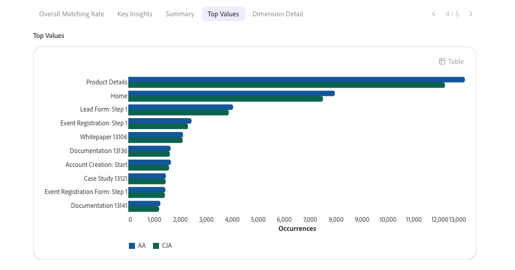

# Validar datos con su compañero de trabajo al actualizar de Adobe Analytics a Customer Journey Analytics

CX Enterprise Coworker incluye una habilidad de validación que le permite validar datos al actualizar de Adobe Analytics a Customer Journey Analytics. La validación de datos se completa en una sola conversación.

Esta aptitud compara automáticamente:

* Cada dimensión, métrica y tendencia individualmente en las implementaciones.

* Todos los grupos de informes de Adobe Analytics con todas las vistas de datos de Customer Journey Analytics.

Después de realizar estas comparaciones, la aptitud genera perspectivas y recomendaciones impulsadas por IA que puede implementar para facilitar la actualización a Customer Journey Analytics.

## Antes de empezar

Para validar los datos como parte de la actualización, necesita lo siguiente:

* El grupo de informes de Adobe Analytics que desea validar.

* La vista de datos de Customer Journey Analytics que contiene los mismos datos.

No necesita saber cómo se ha creado su implementación con antelación. La aptitud detecta automáticamente si los datos se asignan mediante un conector de origen de Analytics o mediante dos implementaciones en paralelo, por lo que no tiene que proporcionar ese contexto usted mismo.

## Iniciar una sesión de validación

1. Inicie sesión en CX Enterprise Coworker.

1. Seleccione [!UICONTROL **Nuevo chat**].

1. En el campo de texto, solicite al agente que valide la migración de Adobe Analytics a Customer Journey Analytics:

   **Mensaje**

   > Ayúdeme a validar la actualización de mi empresa de Adobe Analytics a Customer Journey Analytics.

   La solicitud se dirige a la aptitud de validación de datos, que inicia un proceso de configuración interactivo.

1. El proceso de configuración incluye las preguntas de la tabla siguiente. Para cada pregunta, selecciona una respuesta y luego selecciona [!UICONTROL **Enviar**].

   >[!NOTE]
   >
   >Puede cambiar cualquiera de estas selecciones más adelante en la misma conversación. Por ejemplo, pídale al agente que cambie el grupo de informes o la vista de datos, y el agente solo repetirá los pasos necesarios para actualizar esa selección, sin reiniciar todo el proceso de instalación.

   | Pregunta | Contexto adicional |
   |---------|----------|
   | [!UICONTROL **Seleccione su empresa de Analytics**] | Esta es su compañía de inicio de sesión de Adobe Analytics. |
   | [!UICONTROL **Seleccione su grupo de informes**] <!--In the UI, recommend change to "Select your Adobe Analytics report suite"--> | Este es el grupo de informes de Adobe Analytics que contiene los datos que desea validar con los datos de Customer Journey Analytics. |
   | [!UICONTROL **Seleccione su vista de datos de Customer Journey Analytics**] | Es la vista de datos de Customer Journey Analytics que contiene los mismos datos que el grupo de informes de Adobe Analytics que ha seleccionado. |

1. Revise el resumen de la configuración para confirmar que está validando los datos correctos antes de continuar. El resumen incluye la empresa, el grupo de informes y la vista de datos seleccionados, así como una vista previa de las métricas y dimensiones principales de cada sistema.

1. Continúe con la siguiente sección: [Elija los datos que desea validar](#choose-the-data-to-validate).

## Elija los datos que desea validar

Puede validar métricas o dimensiones individuales, o bien puede validar todas las métricas y dimensiones que se incluyen en el grupo de informes y en la vista de datos.

1. Seleccione entre las siguientes opciones:

   | Opción de validación | Descripción |
   |---------|----------|
   | [!UICONTROL **Comparación de métrica única**] | Comparar la tendencia de una métrica entre Adobe Analytics y Customer Journey Analytics. Utilícelo cuando desee realizar una comprobación rápida de una métrica específica, como vistas de página o visitas. |
   | [!UICONTROL **Comparación de dimensión única**] | Compare el desglose de una sola dimensión entre Adobe Analytics y Customer Journey Analytics. Utilícelo cuando sospeche una diferencia de asignación o clasificación para una dimensión específica. |
   | [!UICONTROL **Auditoría completa de grupos de informes y vistas de datos**] | Compare hasta 40 métricas y 10 dimensiones en una sola ejecución. Utilícelo cuando desee obtener una vista completa del estado general de la migración. |

1. Continúe con la siguiente sección [Revisar el análisis](#review-the-analysis).

## Revisión del análisis

1. Seleccione la ficha [!UICONTROL **Tasa de coincidencia general**] para ver un porcentaje que indica en qué medida coinciden los datos del grupo de informes de Adobe Analytics con los de la vista de datos de Customer Journey Analytics. Esta puntuación siempre aparece primero, antes que cualquier otro resultado. Pesa todas las métricas y dimensiones comparadas por igual para garantizar que las métricas de gran volumen, como las vistas de página, no distorsionen la puntuación.

   Utilice la siguiente escala para interpretar la puntuación:

   | Puntuación | Clasificación | Lo que significa |
   |---------|----------|----------|
   | 97-100% |  [!UICONTROL Excelente] | Todas las propiedades están altamente alineadas. No se requiere ninguna acción. |
   | 90-96 % |  [!UICONTROL Bueno] | Hay brechas menores. Monitorice las tendencias e investigue si disminuyen. |
   | 75-89 % |  [!UICONTROL Revisión] | Existen brechas significativas. Investigue las causas raíz antes de depender de los datos de Customer Journey Analytics. |
   | Menos del 75% |  [!UICONTROL Pobre] | Desalineación significativa. Realice acciones inmediatas antes de utilizar los datos de Customer Journey Analytics. |

1. Seleccione la ficha [!UICONTROL **Información clave**] para ver de dos a cuatro cuadros de llamada cortos, cada uno de los cuales resume un resultado del análisis en una sola frase. Las llamadas están codificadas por gravedad para que pueda identificar primero los hallazgos más importantes.

1. Seleccione la pestaña [!UICONTROL **Resumen**] para ver los totales de Adobe Analytics, los totales de Customer Journey Analytics, la varianza total, los días que pasan y los días críticos, donde los días que pasan y los días críticos reflejan cuántos días del intervalo de fechas entran en los estados de varianza [!UICONTROL **Pasar**] y [!UICONTROL **Crítico**] que se describen a continuación.

1. (Condicional) Al realizar una comparación de una sola dimensión o una comparación de métrica única, puede ver una comparación en paralelo de los datos de Adobe Analytics y los datos de Customer Journey Analytics en la pestaña [!UICONTROL **Tendencia diaria**].

   En el caso de las métricas, se trata de un gráfico de líneas que compara la tendencia diaria.

   

   Para las dimensiones, se trata de un gráfico de barras que compara los valores principales.

   

1. (Condicional) Al realizar una comparación de una sola dimensión o una comparación de métrica única, puede ver los detalles de nivel de fila en la pestaña [!UICONTROL **Detalle de fecha**]. En esta tabla se muestra la fecha, el valor de Adobe Analytics, el valor de Customer Journey Analytics, el porcentaje de varianza y un distintivo de estado para cada métrica o valor de dimensión comparado.

   

   Las columnas Variación y Estado utilizan la siguiente escala:

   | Varianza | Estado | Lo que significa |
   |---------|----------|----------|
   | Menos del 3% |  [!UICONTROL Aprobado] | Los datos están bien alineados. No se requiere ninguna acción. |
   | 3-10 % |  [!UICONTROL Indicador] | Monitorice la diferencia e investigue si continúa o empeora. |
   | Superior al 10 % |  [!UICONTROL Crítico] | Investigue inmediatamente. Esto generalmente apunta a un problema de esquema, ingesta o asignación. |

1. (Condicional) Al ejecutar una auditoría de vista de datos y un grupo de informes completos, las pestañas [!UICONTROL **Tendencia diaria**] y [!UICONTROL **Detalle diario**] se reemplazan con un cuadro de resultados que muestra los recuentos correctos, marcados y críticos, junto con tablas independientes que enumeran las cinco métricas y dimensiones que mejor coinciden y las cinco principales que menos coinciden.

1. Desplácese hacia abajo por el análisis para ver otros patrones y problemas que se descubrieron durante el análisis, las causas probables de dichos patrones y las acciones sugeridas que puede realizar para resolver cualquier discrepancia en los datos.

   >[!NOTE]
   >
   >Se esperan algunas variaciones que no indican ningún problema con la migración.

   Los problemas comunes incluyen:

   * Adobe Analytics cuenta los visitantes basados en el dispositivo, mientras que Customer Journey Analytics cuenta las personas, mediante la vinculación de identidad entre dispositivos.
   * Adobe Analytics procesa los datos en el momento de la recopilación, mientras que Customer Journey Analytics los procesa en el momento del informe.
   * Las definiciones de sesión difieren: las visitas de Adobe Analytics utilizan un tiempo de espera fijo, mientras que las sesiones de Customer Journey Analytics se pueden configurar.
   * Adobe Analytics filtra los bots de forma predeterminada, mientras que el filtrado de bots de Customer Journey Analytics es opcional.
   * Adobe Analytics informa de los valores que faltan como &quot;No especificado&quot; o &quot;Ninguno&quot;, mientras que Customer Journey Analytics informa de ellos como &quot;Sin valor&quot;.
   * Las diferencias de canal de marketing pueden ser el resultado de reglas de procesamiento de Adobe Analytics comparadas con campos derivados de Customer Journey Analytics aplicados de forma retroactiva.
   * Si los valores de Customer Journey Analytics son consistentes con aproximadamente el doble de los valores de Adobe Analytics en todas las métricas, esto generalmente indica datos duplicados en la vista de datos en lugar de un efecto de vinculación de identidad.

1. Compruebe que las acciones sugeridas son válidas y, a continuación, resuelva el problema en Adobe Experience Platform o Adobe Analytics.

1. (Opcional) Continúe con el análisis analizando otra métrica, analizando otra dimensión o ejecutando otro informe de hasta 40 métricas y 10 dimensiones, como se describe en [Elija los datos que desea validar](#choose-the-data-to-validate). No es necesario que repita el proceso de configuración para hacerlo; su empresa, grupo de informes y selecciones de vista de datos se transfieren a lo largo de la conversación.

